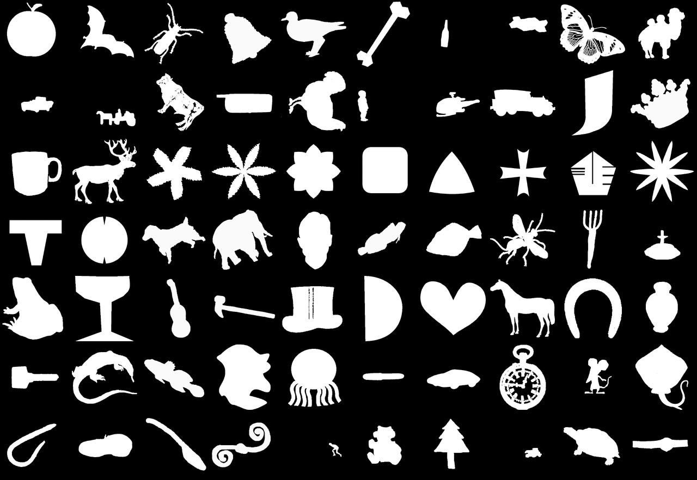
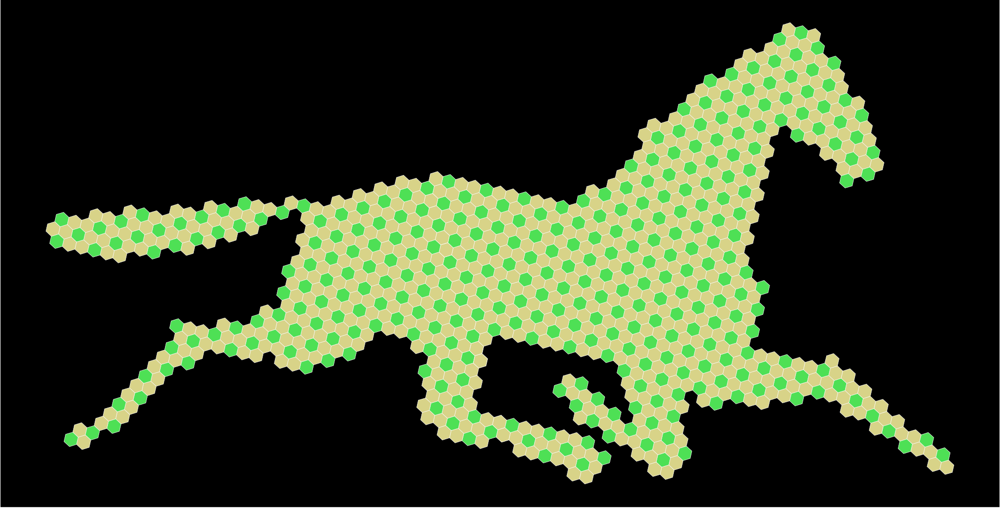
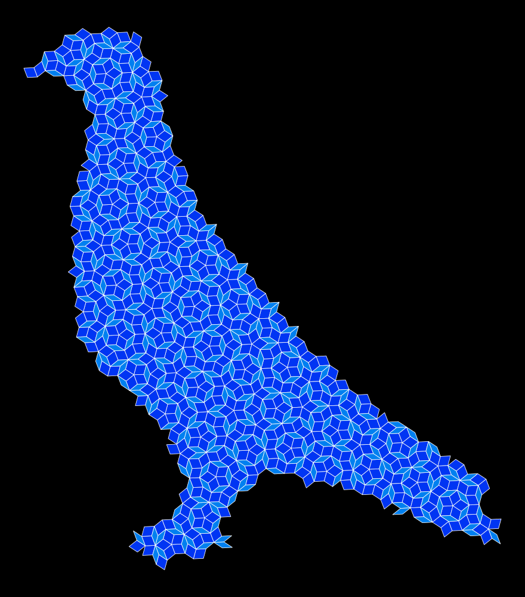

# Penrose Diffusion

**Learning to generate aperiodic Penrose tilings (and hexagonal tiling) using class-conditional diffusion models.**

This is a geometric **Denoising Diffusion Probabilistic Model (DDPM/DDIM)** that generates:

- Aperiodic Penrose P3 tilings with *5-fold symmetry*
- Periodic Hexagonal tilings with *6-fold symmetry*


The tiles form an overall shape dictated by semantic class labels. The shapes come from silhouettes of the **MPEG-7 Core Experiment Shape-1 Part B**. 

## Data

### MPEG-7 “base” data

- 70 distinct classes (e.g., apple, fish, bat, chopper, etc.)
- Each class has *20* different sihouttes
- Total 1400 unique silhouttes to base of off



### Data Generation

- **Mimic**ing a single silhoutte, tiles are ‘cut out’ of a mother canvas of rhombuses or hexagons.
- **Endless** amount of tessellations can be generated to mimic one silhoutte by snipping from different parts of the canvas and by rotating it at different angles 

- **Dual Rotation** for every training step, we apply random rotations to both the underlying tile canvas and the target silhouette mask independently.

- This acts as **Regularization** as the model never sees the exact same arrangement of tiles twice, preventing memorization and encouraging robust geometric generalization.

### Uniform Sample Complexity

A major challenge in geometric modeling is varying density amongst silhouettes. Some are dense some are light. We solve this with a **dynamic scaling algorithm**:

- Regardless of the class (e.g., a thin pencil vs. a bulky elephant), we automatically scale the silhouette so that it is filled by a **fixed, target-number of tiles** (e.g., 768 tiles).
- This ensures we have the exact same dimension for every data sample.

### Representation
- A single sample represented as N (say 768) pentagons. 
- Each pentagon is represented as a center and an orientation
- One sample is N x 4 matrix of (x, y, angle and color) 
  
  * `(x, y)` have zero-mean and unit variance
  * `angle` $\in [-\pi, \pi]$
  * `color` $\in \{0, 1\}$ 

#### Color Constraint
- Each pentagon also has a **binary** color property
- For *6-fold* symmetry

  * `Uncolored` tiles are 0 (2/3)
  * `Colored` tiles are ` (1/3)
  * Colored tiles should not be touching each other


- For *5-fold* symmetry
    
  * `Fatt` tiles are 0 (61.8%) 
  * `Thin` tiles are 1 (38.2%)
  * Together they should obey the Penrose P3 rules


## Architecture

### Model Components

- **Denoiser**: Transformer encoder that predicts noise or samples by conditiontioning on:
  - Class
  - Time
  - Colors of tiles
- **Diffuser**: DDIM/DDPM diffusion process manager (1000 timesteps)
  - Forward process adds noise to `x, y, angle`
  - Reverse process denoises using the `Denoiser`
- **Augmenter**: Perturbs the data a bit by translation and rotation during training


### Hardware Compatibility

The codebase automatically detects and adapts to available hardware:

- **TPU (v4/v5e/v6e)**: `torch_xla` with PJRT runtime for distributed training
- **GPU**: Standard PyTorch with CUDA acceleration
- **CPU**: Fallback mode for development and testing

## Loss Functions

The model supports multiple training objectives:

### Standard Losses

1. **Noise Prediction Loss (NPL)**: Standard DDIM, predicts added noise
2. **Sample Prediction Loss (SPL)**: Directly predicts clean samples

**Geometric Constraints**: Custom loss terms can enforce valid unit-circle properties for orientation parameters (sin θ, cos θ).

3. **Sample & Angle Loss (SAL)**: SPL with circle regularization as assistance

### Permutation-Invariant Losses

The above loss functions do not take into account the permutation invariance for sets of tiles, where the order of tiles doesn't matter. Advanced `Linear Sum Assignment (LSA)` losses handle this. We use the Hungarian Algorithm to find the optimal matching between predicted tiles and ground truth tiles before calculating loss.

4. **LSA Serial Loss (LSL)**: Sample is predicted and the minimum loss to any permutation of the original sample is considered.
5. **LSA Parallel Loss (LPL)**: Sample is recovered from predicted Noise. Loss is the distance of this recovered sample to a permutation of data that is closed to the original data sample itself. *Note: This permutation of the orignial data can be calculated in parallel on the CPU, while the `Denoiser` is running, at no additional cost.*

## Output

We provide a comprehensive **SVG** engine to visualize outputs. Unlike pixel plots, our scripts generate resolution-independent `svg` files, allowing you to inspect individual tile placements, angles, and types. This keeps the view scalable and customizable.

## Installation

```bash
# Clone repository
git clone https://github.com/rakeshvar/penrose_diffusion
cd penrose_diffusion

# Install dependencies
pip install torch numpy tqdm scipy wandb

# For TPU support (optional)
pip install torch-xla[tpu] -f https://storage.googleapis.com/libtpu-releases/index.html
```

## Usage

### 1. Create Dataset [Optional]

Generate training data from MPEG7 shape masks:

```bash
python -m scripts.create_dataset <symmetry> <num_tiles> <num_copies> [unit_side]
```

**Examples:**
```bash
# Hexagonal tilings with 96 tiles, 100 copies per silhoutte
python -m scripts.create_dataset 6 96 100 0.18

# Penrose tilings with 512 tiles, 50 copies per silhoutte  
python -m scripts.create_dataset 5 512 50 0.1
```

This creates an `.npz` file in `datasets/` containing:
- `xya`: Tile positions and orientation angles. (B, N, 3)
- `colors`: Binary colors (0 or 1). (B, N)
- `labels`: Shape class IDs (0-69). (B,)
- Metadata
  - `symmetry`: 5=Penrose, 6=Hexagons
  - `side_length`: of each rhombus or hexagon (defaults to a value that leads to unit variance for `x`, `y`)
  - `class_lookup_table` 

where:
 - `B` = 70 * 20 * num_copies 
 - `N` = number of tiles in each sample

### 2. Train Model

```bash
python train.py [dataset.npz] [config_group] [checkpoint.pt] [options]
```

**Examples:**
```bash
# Train from scratch with default config
python train.py datasets/hex_t096_c100_u18.npz

# Resume from checkpoint (using the same dataset)
python train.py checkpoint.pt

# Use small model config
python train.py datasets/hex_t096_c100_u18.npz small

# Override training parameters
python train.py datasets/hex_t096_c100_u18.npz -t lr=0.0005 -t batch_size=32 -t num_epochs=99 -t loss=lsaserial -d num_layers=4
```

**Training produces:**
- Checkpoints saved to `checkpoints/` (keeps latest 2)
- Sample SVGs saved to `samples/` each epoch

### 3. Generate Samples

Interactive sampling from trained checkpoint:

```bash
python -m scripts.sample <checkpoint.pt>
```

The sampler will prompt for class selection, and creates a series of svg images starting from random noise to a created image of that class.


## Configuration

Model and training settings are defined in `configs.yaml`:

```yaml
# Denoiser settings
default_denoiser:
  num_classes: 70
  d_model: 64
  num_heads: 4
  num_layers: 4
  dropout: 0.1

# Training settings
default_train:
  lr: 0.001
  batch_size: 64
  num_epochs: 100
  loss: 'Noise'
```

**Config groups:** `default`, `toy`, `small`, `large`, etc.

**Override options:**
- `-d key=value`: Override denoiser config
- `-t key=value`: Override training config

**Loss options:** `noise`, `sample`, `sampleangle`, `lsaserial`, `lsaparallel`

## TPU Training

For Google Cloud TPU v6e, see [`v6e_setup_guide.md`](v6e_setup_guide.md) for complete setup instructions.


## Project Structure

```
code/
├── model/
│   ├── ddim.py           # DDIM diffuser &  denoiser
│   ├── losses.py         # Loss functions
│   ├── augment.py        # Geometric data augmentation
│   └── sampler.py        # Sampling as SVG
├── data/
│   ├── imageset.py       # MPEG7 solhoutte image loading
│   ├── generator.py      # Generate tilings
│   ├── create.py         # Save tilings as npz file
│   └── load.py           # Load from npz file
├── hex/
│   ├── base.py          # Hexagonal tiling logic
│   ...
├── pen/
│   ├── base.py          # Penrose tiling logic
│   ...
├── config.py            # Configuration management
├── utils.py             # Utility functions
└── compatibility.py     # TPU/GPU/CPU compatibility layer
scripts/
├── sample.py            # Interactive sampling
└── create_dataset.py    # Dataset creation
tests/
└── ...                  # Tests and trails
train.py                 # Main training script
configs.yaml             # Model configurations
```

## How It Works (Details)

### 1. Data Generation

Unlike traditional approaches that cache a fixed dataset, our generator creates unique samples dynamically:

- **Load shape masks** from MPEG7 dataset (70 classes)
- **Generate tile canvas** (of 5/6-fold symmetry) covering the target area at appropriate density
- **Dynamic scaling**: Scale each silhouette to contain exactly `num_tiles` tiles regardless of shape complexity
- **Dual rotation**: Independently rotate both the tile canvas and the shape mask
- **Random translation**: Position the mask randomly over the tile grid
- **Sample tiles**: Select tiles that overlap with the shape mask (**complicated coverage-based sampling**)
- Center each sample around the origin
- **Store as tensors**: (x, y, angle, color) tuples with consistent shape `(B, N, 4)`

#### Exact Coverage
We want each sample to have exactly `N` hexagons:
- We scale the silhoutte up by the proper value inversely proportional to its density. 
  - The sparser the silhoutte, the more we have to scale it up 
  - and viceversa
- Now we collect all the pentagons that have all the four ‘pseudo’ vertices within mask
- That is usually not enough then we add more pentagons that have three ‘pseudo’ vertices within mask
- If that is not enough — two. These are exactly on the border
- Rarely do we have those with only one within the mask 


This is well-vectorized, but we do it only once on the CPU apriori and save it to an `npz` file, as it could be a speed bottle neck to do this coverage algorithm for every single data sample.

### 2. Training

- **Convert angles** to (sin θ, cos θ) for continuity on the unit circle
- **Apply geometric augmentation** each epoch (additional rotation + translation)
- **Forward diffusion**: Gradually add Gaussian noise ($x$ represents the `N x 4` matrix of $(x, y, sin θ, cos θ)$): $$x_t = \sqrtᾱ_t ~ x_0 + \sqrt(1-ᾱ_t) ~ ε $$
- **Train transformer** to predict noise $ \hat ε $ or clean samples $\hat x_0 $
  - Conditioned on `t`, the array of `colors` and the `class label`
- **Loss computation**: as above
- Timesteps: 1000 (training)

### 3. Sampling

- Start from pure Gaussian noise
- Iteratively denoise using DDIM/DDPM (50 steps)
   - Using the Transformer Denoiser
   - Condition on time, class shape and colors
   - DDPM with configurable η (DDIM when η=0)
- Normalize angles to unit circle at final step
- Export as SVG


## Requirements

- Python 3.8+
- PyTorch 2.0+
- numpy
- tqdm
- scipy

**Optional:**
- `torch-xla` for TPU support
- `torch-linear-assignment` for faster LSA on GPU with CUDA

## Citation

```bibtex
@software{penrose_diffusion,
  author = {Rakeshvara},
  title = {Penrose Diffusion: Conditional Tiling Generation with Diffusion Models},
  year = {2025},
  url = {https://github.com/rakeshvar/penrose_diffusion}
}
```

## License

MIT License