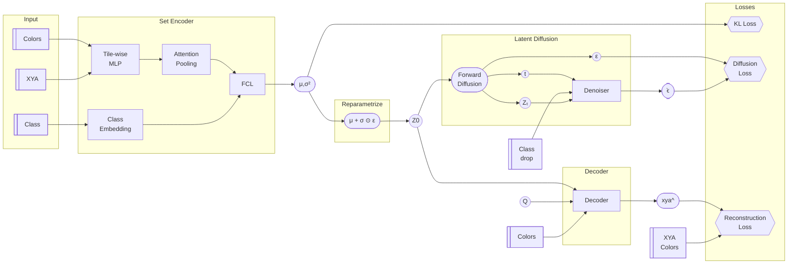

# LION

```mermaid
flowchart LR

%% Inputs
subgraph INPUT1["Input"]
XYA@{ shape: lin-rect, label: "XYA" }
COLORS@{ shape: lin-rect, label: "Colors" }
CLASS@{ shape: lin-rect, label: "Class" }
end

XYA2@{ shape: lin-rect, label: "XYA
Colors" }
COLORS2@{ shape: lin-rect, label: "Colors" }
CLASS2@{ shape: lin-rect, label: "Class
drop" }

%% Encoder
subgraph ENC["Set Encoder"]
  TWMLP["Tile-wise 
    MLP"]
  ATTNPOOL["Attention 
    Pooling"]
  CLSEMBD["Class 
    Embedding"]
  FCL["FCL"]
end

COLORS --> TWMLP
XYA --> TWMLP --> ATTNPOOL --> FCL
CLASS --> CLSEMBD --> FCL
FCL --> MUSIGMA2(["μ,σ²"]) --> LKL{{"KL Loss"}}

subgraph REPARAMETRIZE["Reparametrize"]
  REPARAM(["μ + σ ⊙ ε"])
end
MUSIGMA2 --> REPARAM --> Z0(("Z0"))

subgraph DIFFUSION["Latent Diffusion"]
  EPS(("ε"))
  FWDIFF(["Forward 
    Diffusion"])
  DENOISER["Denoiser"]
  ZT(("Zₜ"))
  T(("t"))
end

FWDIFF --> EPS --> LDIFF
FWDIFF --> T --> DENOISER

CLASS2 --> DENOISER
Z0 --> FWDIFF --> ZT --> DENOISER --> EPSHAT([" ̂ϵ"])  --> LDIFF

%% Decoder
subgraph DEC["Decoder"]
  DECODER["Decoder"]
end
Z0 --> DECODER
Q(("Q")) --> DECODER

DECODER --> Tiles(["xya^"]) --> LREC
COLORS2 --> DECODER

%% Losses
LREC{{"Reconstruction 
Loss"}}
LDIFF{{"Diffusion 
Loss"}}
XYA2 --> LREC
subgraph LOSSES["Losses"]
 LREC
 LKL
 LDIFF
end
```

## Sampling

```mermaid
flowchart LR

%% Inputs
subgraph Input
  COLORS@{ shape: lin-rect, label: "Colors" }
  CLASS@{ shape: lin-rect, label: "Class" }
end

NOISE(["zₜ  ~ 𝒩 (0, I)"]) --> Denoiser
CLASS --> Denoiser
Denoiser --> Z0(("z_(t-1)")) --> Decoder

COLORS --> Decoder --> X(("Sample"))

```