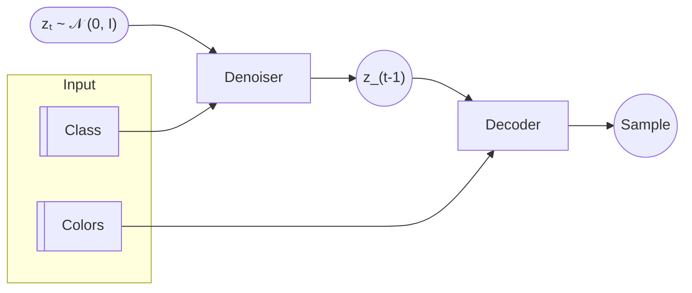
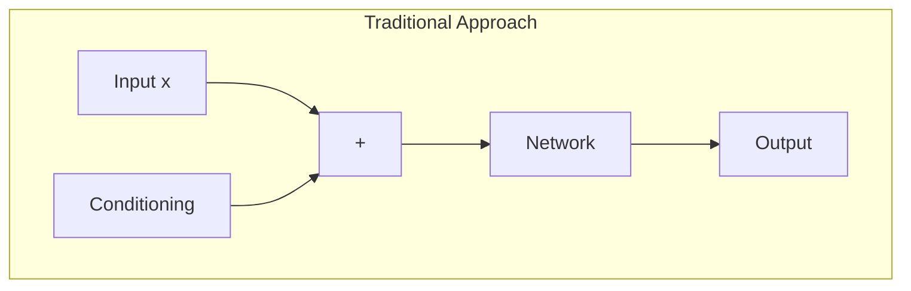
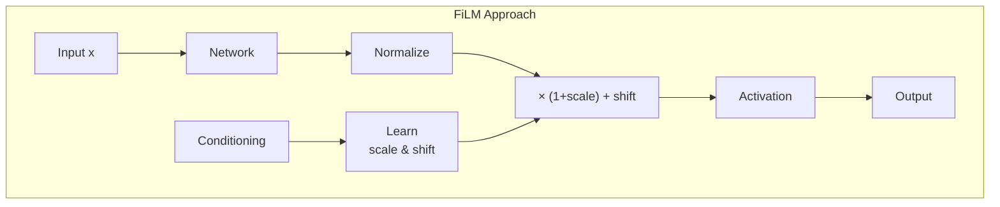
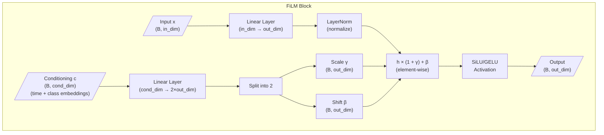

# LION

```mermaid
flowchart LR

%% Inputs
subgraph INPUT1["Input"]
XYA@{ shape: lin-rect, label: "XYA" }
COLORS@{ shape: lin-rect, label: "Colors" }
CLASS@{ shape: lin-rect, label: "Class" }
end

XYA2@{ shape: lin-rect, label: "XYA
Colors" }
COLORS2@{ shape: lin-rect, label: "Colors" }
CLASS2@{ shape: lin-rect, label: "Class
drop" }

%% Encoder
subgraph ENC["Set Encoder"]
  QE(("Q"))
  TWMLP["Tile-wise
    MLP"]
  ATTNPOOL["Attention
    Pooling"]
  CLSEMBD["Class
    Embedding"]
  FCL["FCL"]
end

COLORS --> TWMLP
QE --> ATTNPOOL
XYA --> TWMLP --> ATTNPOOL --> FCL
CLASS --> CLSEMBD --> FCL
FCL --> MUSIGMA2(["μ,σ²"]) --> LKL{{"KL Loss"}}

subgraph REPARAMETRIZE["Reparametrize"]
  REPARAM(["μ + σ ⊙ ε"])
end
MUSIGMA2 --> REPARAM --> Z0(("Z0"))

subgraph DIFFUSION["Latent Diffusion"]
  EPS(("ε"))
  FWDIFF(["Forward
    Diffusion"])
  DENOISER["Denoiser"]
  ZT(("Zₜ"))
  T(("t"))
end

EPS --> FWDIFF
EPS --> LDIFF
T --> FWDIFF
T --> DENOISER

CLASS2 --> DENOISER
Z0 --> FWDIFF --> ZT --> DENOISER --> EPSHAT([" ̂ϵ"])  --> LDIFF

%% Decoder
subgraph DEC["Decoder"]
  DECODER["Decoder"]
  Q
end
Z0 --> DECODER
Q(("Q")) --> DECODER

DECODER --> Tiles(["xya^"]) --> LREC
COLORS2 --> DECODER

%% Losses
LREC{{"Reconstruction
Loss"}}
LDIFF{{"Diffusion
Loss"}}
XYA2 --> LREC
subgraph LOSSES["Losses"]
 LREC
 LKL
 LDIFF
end
```

## Sampling

```mermaid
flowchart LR

%% Inputs
subgraph Input
  COLORS@{ shape: lin-rect, label: "Colors" }
  CLASS@{ shape: lin-rect, label: "Class" }
end

NOISE(["zₜ  ~ 𝒩 (0, I)"]) --> Denoiser
CLASS --> Denoiser
Denoiser --> Z0(("z_(t-1)")) --> Decoder

COLORS --> Decoder --> X(("Sample"))

```

## FILM

```mermaid
graph TB
    subgraph "Traditional Approach"
        A1[Input x] --> Add1["+"]
        A2[Conditioning] --> Add1
        Add1 --> A3[Network]
        A3 --> A4[Output]
    end
```

```mermaid
graph TB
    subgraph "FiLM Approach"
        B1[Input x] --> B3[Network]
        B3 --> B4["Normalize"]
        B4 --> Mod["× (1+scale) + shift"]
        B2[Conditioning] --> Learn["Learn<br/>scale & shift"]
        Learn --> Mod
        Mod --> B5[Activation]
        B5 --> B6[Output]
    end
```

```mermaid
graph TB
    subgraph "FiLM Block"
        Input[/"Input x<br/>(B, in_dim)"/]
        Cond[/"Conditioning c<br/>(B, cond_dim)<br/>(time + class embeddings)"/]

        Input --> Linear["Linear Layer<br/>(in_dim → out_dim)"]
        Linear --> Norm["LayerNorm<br/>(normalize)"]

        Cond --> FiLMNet["Linear Layer<br/>(cond_dim → 2×out_dim)"]
        FiLMNet --> Split["Split into 2"]
        Split --> Scale["Scale γ<br/>(B, out_dim)"]
        Split --> Shift["Shift β<br/>(B, out_dim)"]

        Norm --> Modulate["h × (1 + γ) + β<br/>(element-wise)"]
        Scale --> Modulate
        Shift --> Modulate

        Modulate --> Act["SiLU/GELU<br/>Activation"]
        Act --> Output[/"Output<br/>(B, out_dim)"/]
    end
```